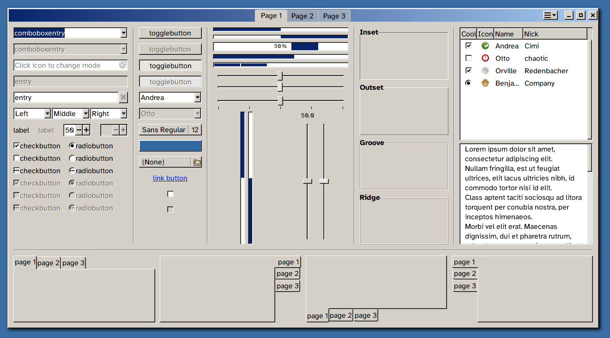

# Y2K GTK3 theme

A reactionary theme with a total disregard for touch interfaces.



It's a bit hacky and terrible, in part because gtk is a bit hacky and terrible and lots of "modern" gtk apps are appearantly *only* tested with the stock Adwaita theme, and in part because I'm not at all skilled at this.

The upside is that the theme is written from scratch, in relatively few lines of CSS, and should be much easier to hack on than most other gtk3 themes.

## Installation
```sh
mkdir -p ~/.themes
cd ~/.themes
git clone https://github.com/rosvall/y2k-gtk-theme.git
```
